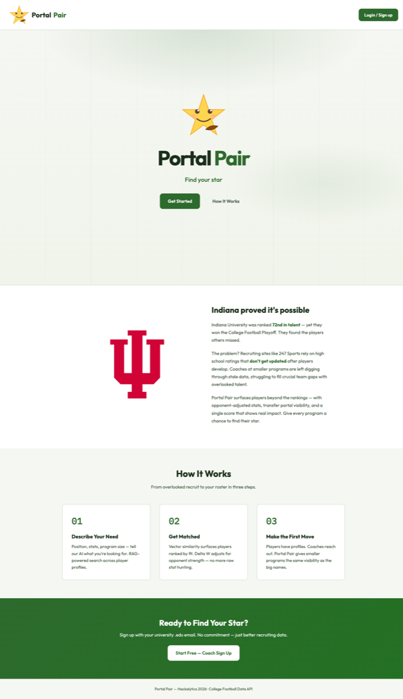
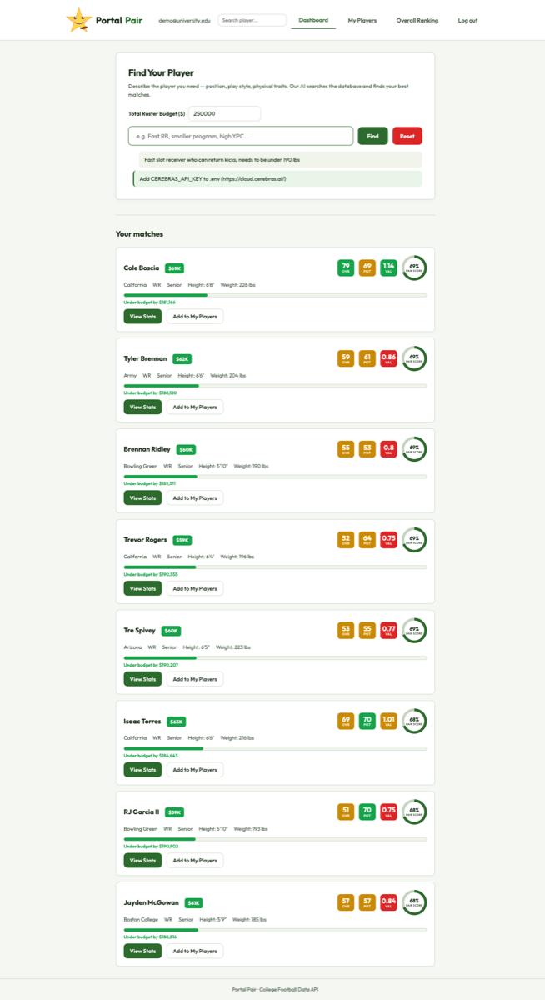
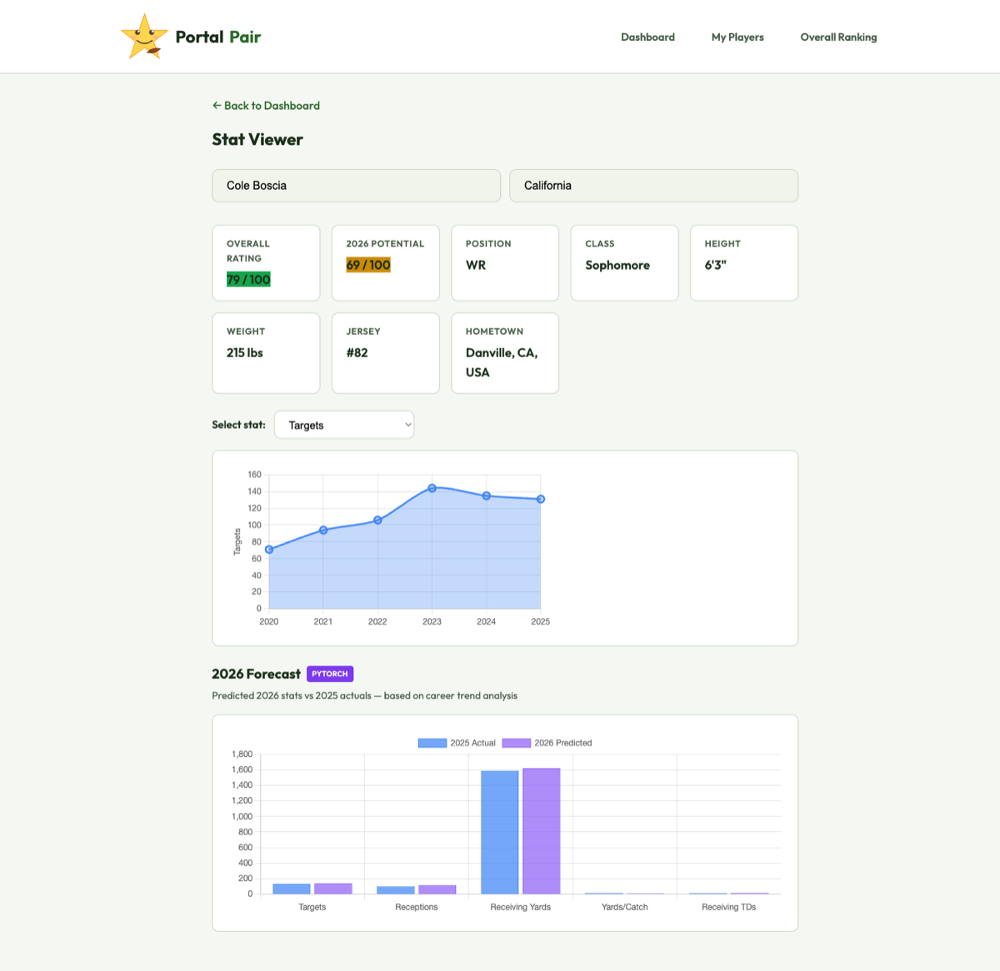
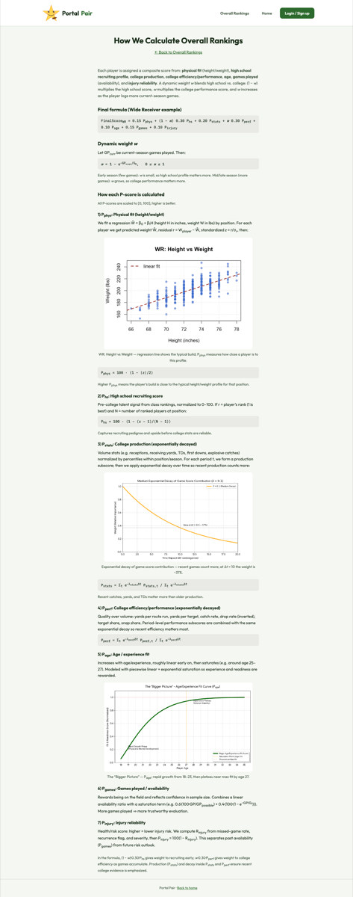
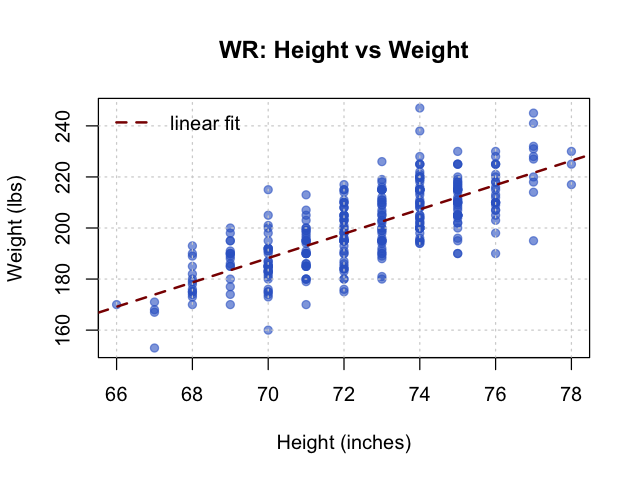
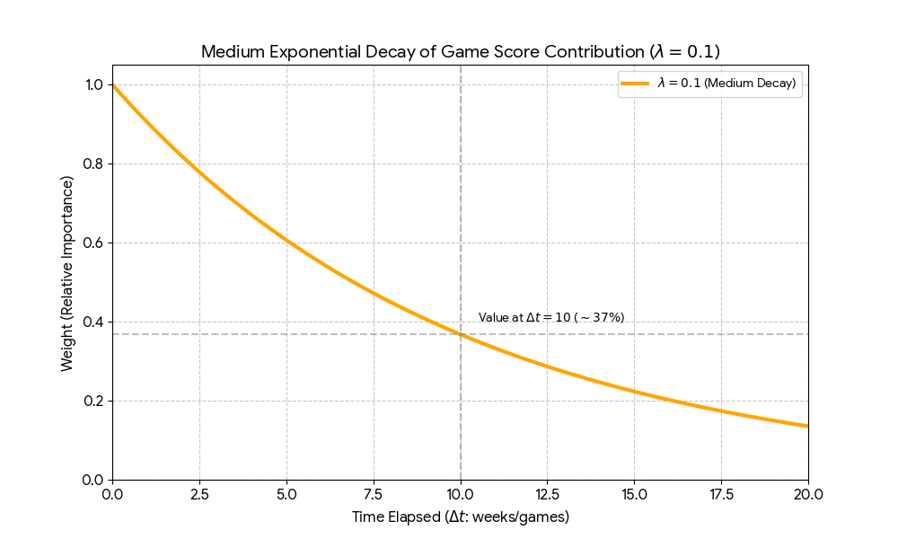
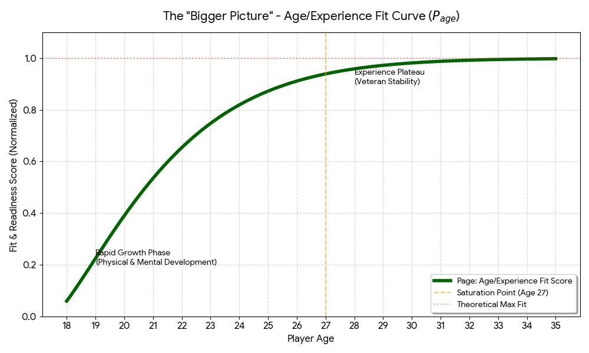

# Portal Pair

**Natural-language talent search for college football coaches.** Describe the player you need — *"fast slot receiver who can return kicks, under 190 lbs"* — and get back ranked, budget-aware matches from a vector database of 813 players across six seasons.

Built in 48 hours at **Hackalytics 2026** (Georgia Tech).

---

## The problem

> **Indiana University was ranked 72nd in talent — yet they won the College Football Playoff. They found the players others missed.**

Recruiting sites like 247Sports rank players on high-school evaluations that are never revisited once those players start developing in college. A coach at a smaller program trying to fill a specific hole is left scrolling stale star ratings, hunting for the guy nobody re-rated.

Portal Pair inverts that. Instead of browsing rankings, a coach *describes the gap* in plain English. The query is embedded and matched by cosine similarity against every player-season in the database, then re-ranked by a composite fit score and filtered against the program's roster budget.

---

## Screenshots

### Landing



### Coach dashboard — natural-language search

A query goes in, ranked matches come out. Each card shows overall rating, 2026 potential, a value ratio, a fit ("pair") score, and where the player lands against the roster budget.



### Stat viewer — per-season trends and a 2026 forecast

Six seasons of per-stat history, plus a forecast for the following season from a small PyTorch trend model.



### Methodology

The scoring model is written up in full at [`how-we-calculate.html`](how-we-calculate.html) — every component, its formula, and the reasoning behind it.



The three plots on that page are committed in [`images/`](images/):

| | |
|---|---|
|  |  |
| **`wr_height_weight.png`** — wide-receiver height plotted against weight with a linear fit. Physical fit is scored as a standardized residual from this line: how far a player sits from the typical build at his position. | **`pstats_decay.png`** — the exponential kernel `e^(−λΔt)` used to weight production, so a good season last year counts for more than a good season four years ago. |



**`page_age_fit.png`** — the age/experience component: rapid growth from 18–23, saturating near a plateau around 27.

The headline idea on that page is the **dynamic weight**:

```
w = 1 − e^(−GP / G₀)
```

`GP` is games played in the current season. Early in the year `w` is near 0, so a player's high-school recruiting profile carries the weight. As college games accumulate, `w` climbs toward 1 and college performance takes over. It's a clean way to say "trust the pedigree until you have evidence, then trust the evidence."

> **Spec vs. shipped.** The methodology page describes a seven-component model. The code that actually produced the ratings in this repo (`scripts/compute_ratings.py`) implements two of them: `final = 0.15 × P_phys + 0.85 × P_composite`, where the composite is exponentially-decayed percentile production at `λ = 0.3` per season. The high-school, age, games-played, and injury components — and `w` itself — are design, not implementation; the data schema has no recruiting-rank, birthdate, or injury fields to compute them from. `P_phys` also ships as a fixed per-position ideal-build lookup rather than a fitted regression. Treat `how-we-calculate.html` as the design document it is.

---

## Architecture

```
Browser (vanilla JS, no build step)
   │
   ▼
Express (server.js, :8080) ── auth (Auth0 passwordless .edu OTP → signed cookie)
   │                       └─ thin proxies to the College Football Data API
   │  spawn: python -m scripts.<name>, JSON over stdout
   ▼
Python (scripts/) ── ChromaDB (chroma_backup/, collection cfb_players, 4,878 records)
                  └─ sentence-transformers all-MiniLM-L6-v2, 384-dim embeddings
                     Cerebras llama3.1-8b writes the prose recommendation (optional)
```

Five lines, expanded: the front end is plain multi-page HTML/CSS/JS with no bundler. A single Express server serves it, owns authentication, and proxies the CFBD API. Anything analytical is a Python subprocess — Express `spawn`s `python -m scripts.<module>`, passes input by argv and environment, and parses JSON off stdout. Each player-season is stored in ChromaDB as a short text summary embedded with MiniLM; a coach's query is embedded the same way and matched by cosine similarity. Retrieved players are filtered on position and physicals, then the top matches are handed to a Cerebras-hosted Llama for the written recommendation.

**Python-backed endpoints:** `/api/coach/suggest` → `scripts/coach_chat.py` · `/api/player/profile` → `get_player_profile.py` · `/api/player/usage-history` → `usage_history.py` · `/api/players/list` → `list_players.py` · `/api/db/status` → `check_db.py`

---

## Running it

Requires **Node 18+** and **Python 3.12** (see `.python-version`).

```bash
git clone https://github.com/ApagPlayz/portalpair.git
cd portalpair

# 1. Node
npm install

# 2. Python — the venv MUST live at ./.venv; server.js looks for
#    ./.venv/bin/python and silently falls back to bare `python3` otherwise
python3.12 -m venv .venv
./.venv/bin/pip install -r requirements.txt

# 3. Config
cp .env.example .env
#    then edit .env and set CFB_API_KEY and COOKIE_SECRET — the server
#    refuses to start without both. A free CFBD key:
#    https://collegefootballdata.com/key

# 4. Go
npm start          # http://localhost:8080
```

No seeding step: the ChromaDB at `chroma_backup/` ships populated with all 4,878 records.

Verify the stack end to end:

```bash
curl localhost:8080/api/db/status
# {"connected":true,"path":".../chroma_backup","playerCount":4878}
```

**Notes and gotchas**

- Without `AUTH0_*` set, login runs in dev mode and accepts **any** 6-digit code. That is the intended local path; set the Auth0 variables (see [`AUTH0_SETUP.md`](AUTH0_SETUP.md)) for real email OTP.
- Without `CEREBRAS_API_KEY`, vector search still works and still returns ranked matches — you just get a "add your key" line instead of the written summary. That is what the dashboard screenshot above shows.
- `npm run serve` is **not** a way to run the app. It starts a static file server on the same port, so every `/api/*` call 404s and the app looks broken. Use `npm start`.
- The Node server reads `CFB_API_KEY`; the Python scripts read `CFBD_API_KEY`. Same credential, two names. Set both.
- `npm start` deliberately strips `HTTP_PROXY`/`HTTPS_PROXY` — a system proxy makes the cached sentence-transformers model fail to load.
- `POST /api/auth/bypass` is registered only when `NODE_ENV !== 'production'`.

---

## ⚠️ Data provenance — read this before trusting any number

**Every production statistic in this repository is synthetic.** Not estimated, not imputed — generated. This section exists because the app presents those numbers in a way that looks authoritative, and they are not.

**What is real (≈85% of the roster):**

693 of the 813 players are real people. Their **names, teams, positions, jersey numbers, hometowns, and their 2020 height and weight** come from the College Football Data API's roster endpoint. Coverage is narrow — the fetch walks the FBS team list alphabetically under a team cap, so the real players come from 19 programs, all A–C (Akron through California). The ESPN Top-100 list behind `fan-rankings.html` (`data/espn_cfb_top100_players_2025_season.csv`) is also real, and is entirely separate from the vector database.

**What is fabricated:**

- **All season statistics, for all 813 players, in all six seasons.** `scripts/expand_seasons.py` draws every stat from a hardcoded per-position `(min, max)` range: `base = lo + span × multiplier`, then `+ random.gauss(0, span × 0.08)`. A consistency pass afterwards patches contradictions (interceptions can't exceed touchdowns, receptions can't exceed targets). CFBD's real usage data *is* fetched by `scripts/fetch_data.py` and then discarded — none of it reaches the database.
- **One career arc, applied to everyone.** The per-season multiplier is `[0.55, 0.70, 0.85, 1.0, 0.93, 0.87]`, hardcoded. Every player in the database peaks in 2023. The only per-player variation is a single `talent = random.uniform(0.55, 1.0)` scalar drawn once and applied across all six seasons. The trend you see in the stat-viewer screenshot above is that curve.
- **120 of the 813 players (14.8%) are entirely invented** — 60 LB, 30 CB, 30 S generated by `scripts/add_players.py` from hardcoded lists of 70 first names, 70 last names, 60 teams, and 25 hometowns. They have no real-world counterpart. They are identifiable in the data by `athlete_id` values starting `gen_` and by `homeCountry = "US"` where real CFBD players have `"USA"`. Notably, **there are no real Indiana players in the database** — every Indiana player is one of these.
- **Height and weight drift after 2020.** The real CFBD physicals are preserved only for the 2020 record; 2021–2025 apply a random per-season delta.
- **Ratings are floored.** `compute_ratings.py` re-spreads every score below 51 onto the range [51, 64], so no player can rate below 51. 605 of 813 players (74%) sit in that band.
- **Forecasts are not reproducible.** `forecast_2026.py` seeds per stat with `hash(stat_name)`, and Python salts string hashing per process, so re-running produces different predictions.

**Why.** This was a 48-hour hackathon. CFBD's historical per-season statistical endpoints are gated behind a paid tier the team didn't have, and the free roster endpoint is rate-limited hard enough that even identity data took most of a day to collect. The choice was to ship a working retrieval-and-ranking system on generated data, or to ship nothing. We chose the former; this note is the part we owe you for it.

**What that means for reading this repo.** The retrieval pipeline, the embedding scheme, the API surface, the scoring code, and the forecasting model are all real and all work — you can run them and inspect them. The *numbers they operate on* are not measurements of anything. Nothing here should be used to evaluate an actual football player.

The landing page also promises "opponent-adjusted stats" and "transfer portal visibility." Neither is implemented. That copy was aspirational and is left in place rather than quietly edited out.

---

## Team

Four people, 48 hours. GitHub's contributor list omits Kriti entirely: she committed from an unconfigured local git identity (`kritikumaran@KritiMacPro.local`) that GitHub can't map to an account. This table is the accurate record.

| | Owned |
|---|---|
| **Alessio Pagliarulo** ([@ApagPlayz](https://github.com/ApagPlayz)) | Analytics engine and integration — season expansion, the ratings model (`compute_ratings.py`), the PyTorch 2026 forecaster, the stat viewer, the coach dashboard and My Players UI, and merging everyone's branches. 24 commits. |
| **senrianath** ([@senrianath](https://github.com/senrianath)) | Foundation and visual identity — initial Express setup, Auth0 authentication, the landing page, the design system in `css/styles.css`, the player-profile dashboard. 12 commits. |
| **Edy Tapu** ([@EdyTapu](https://github.com/EdyTapu)) | Rankings and methodology — `fan-rankings.html`, the ESPN Top-100 pipeline, and `how-we-calculate.html` including the three equation plots. 9 commits. |
| **Kriti Kumaran** | Data and retrieval layer — the CFBD client (`fetch_data.py`), the vector store abstraction (`vector_store.py`), player generation (`add_players.py`), and the RAG coach chatbot (`coach_chat.py`). 9 commits. |

**On AI assistance:** 37 of the 54 hackathon commits on `main` carry a `Co-authored-by: Cursor` trailer. This project was written with heavy AI pair-programming, and the trailers are left in the history deliberately rather than scrubbed. The architecture decisions, the scoring model, and the debugging were ours; a lot of the typing was not.

---

## Repository layout

```
server.js              Express API, auth, CFBD proxy, Python bridge (~540 lines)
*.html                 The pages: index, login, dashboard, my-players,
                       player-profile, stat-viewer, fan-rankings, how-we-calculate
js/                    Per-page vanilla JS, no build step
css/                   Design system and per-page styles
scripts/               Python pipeline and API backends
  ├─ config.py           Environment configuration
  ├─ fetch_data.py       CFBD client with rate-limit backoff
  ├─ vector_store.py     Store abstraction (Chroma / Actian / in-memory)
  ├─ expand_seasons.py   Season synthesis — defines the record schema
  ├─ add_players.py      Generates the 120 fabricated LB/DB players
  ├─ compute_ratings.py  overall_rating
  ├─ forecast_2026.py    PyTorch trend forecaster
  └─ coach_chat.py       RAG retrieval + Cerebras summary
chroma_backup/         Committed ChromaDB (31 MB) — the app's only data store
data/                  ESPN Top-100 CSV
images/                Logos, mascot, and the three methodology plots
docs/screenshots/      README screenshots
```

### Known rough edges

Honest inventory, not a roadmap:

- `chroma_backup/` is 31 MB of binary committed to git, and there is **no script that rebuilds it from scratch** — `expand_seasons.py` reads the existing collection to get its player list, so it can only regenerate seasons for players already in the database. Bootstrapping from nothing would need a live CFBD key and a re-run of `fetch_data.py`. Exporting the collection to a committed JSONL plus a re-embed script is the obvious fix and hasn't been done.
- The four `/api/bookmarks*` routes are dead; the UI persists bookmarks to `localStorage` instead.
- The Actian VectorAI backend in `vector_store.py` is vestigial — `coach_chat.py` forces ChromaDB, and the beta wheel it depended on now 404s (the line is commented out in `requirements.txt`).
- Players are keyed `"First Last::team"`, so same-name teammates would merge.

---

## License

[MIT](LICENSE) © 2026 Alessio Pagliarulo

Player identity data from the [College Football Data API](https://collegefootballdata.com/).
